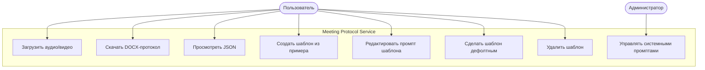
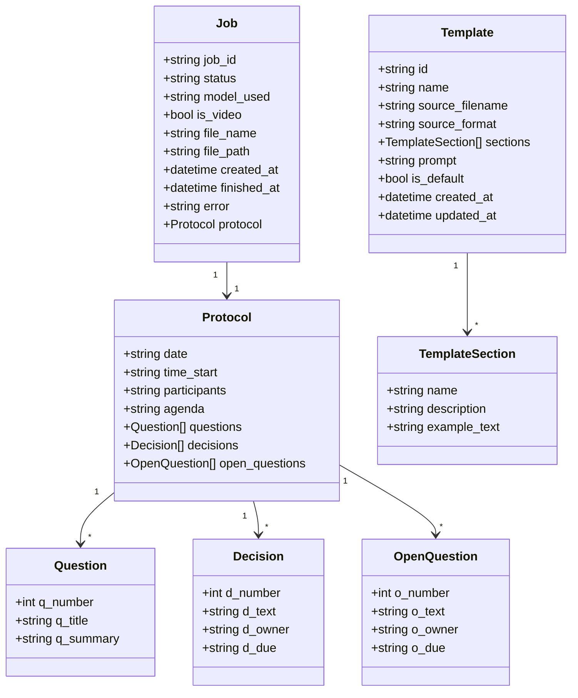
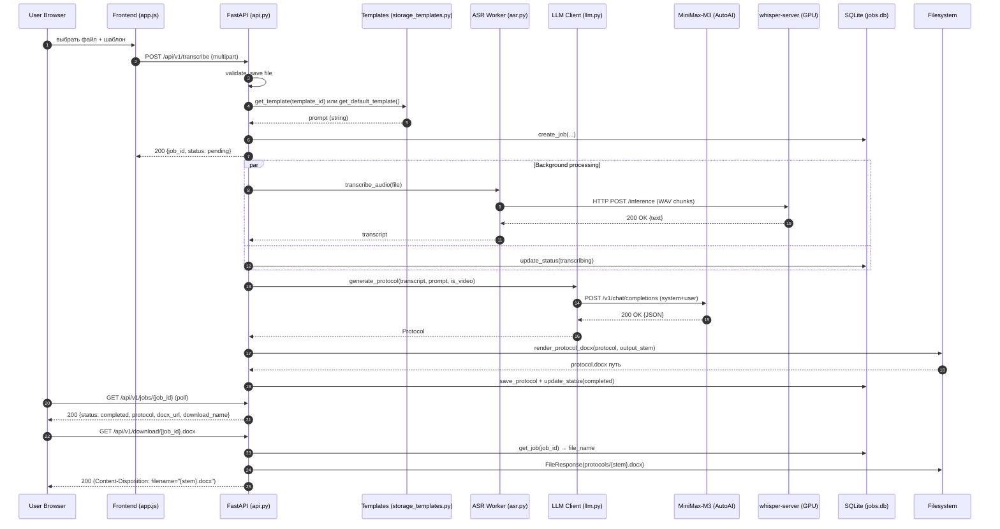
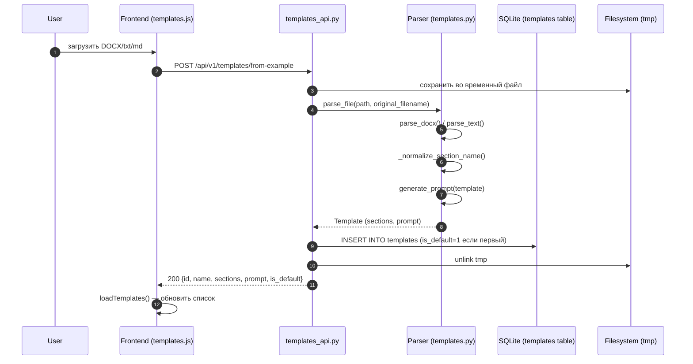
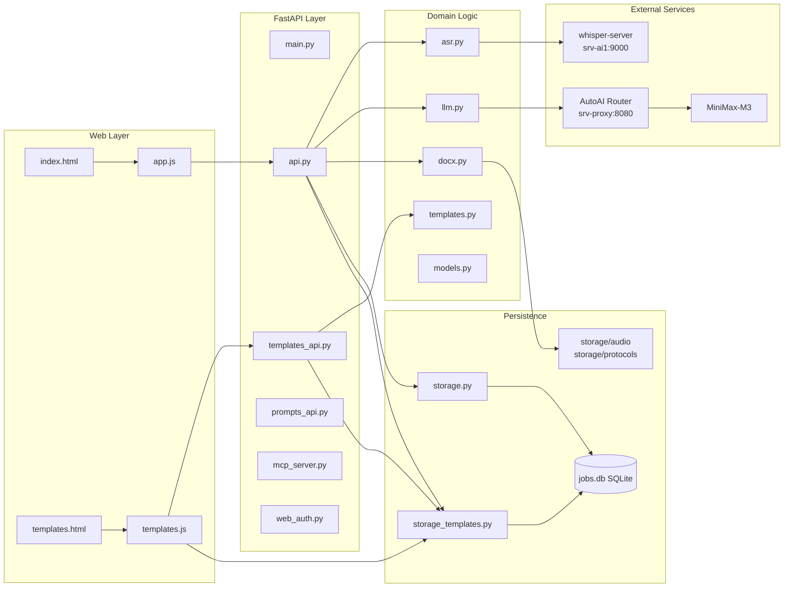
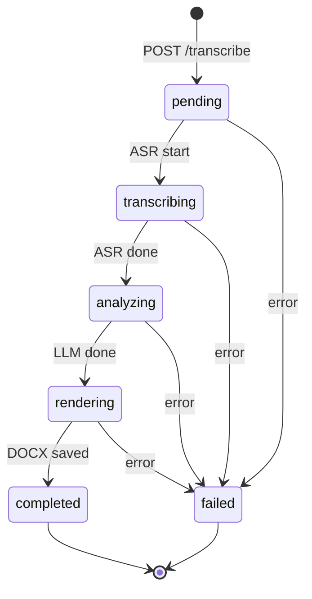
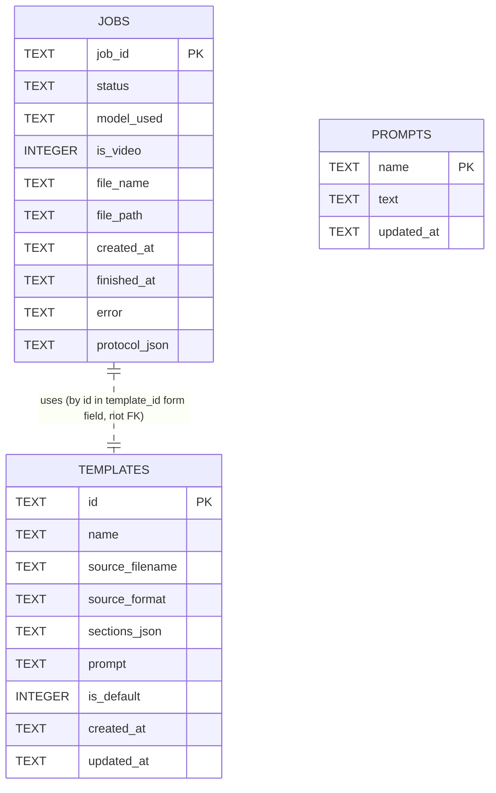

# Meeting Protocol Service

[](https://github.com/gluman/Meetings-Protokol/actions/workflows/ci.yml)
[](https://codecov.io/gh/gluman/Meetings-Protokol)
[](https://www.python.org/)
[](LICENSE)

Сервис транскрибации аудио/видео встреч и генерации протокола в DOCX с возможностью
создания **пользовательских шаблонов протоколов** на основе загруженных примеров.

> **Версия:** 2.0 · **Модель:** MiniMax-M3 (через AutoAI Router) · **ASR:** whisper.cpp на GPU

---

## 🤝 Для ревьюверов

| Роль | Что проверяет | Где смотреть |
|---|---|---|
| **Андрей (UI/функционал)** | Визуал, поведение, UX, сценарии | Web: https://meeting-protocol.gluman.tech/ · Staging: https://staging-meeting-protocol.gluman.tech/ |
| **LLM (код)** | Архитектура, типизация, docstring, тесты | [CI workflow](.github/workflows/ci.yml) · [CONTRIBUTING.md](docs/CONTRIBUTING.md) · [docs/CI-CD-RULES.md](docs/CI-CD-RULES.md) |

**Конвенции кода (для LLM-ревью):**
- Python 3.12, type hints обязательны на всех публичных сигнатурах
- Docstring в формате Google/NumPy на всех публичных функциях и классах
- Имена: `snake_case` (функции/переменные), `PascalCase` (классы), `UPPER_SNAKE` (константы)
- SQL: только параметризованные запросы через `?` placeholder
- БД-миграции: `CREATE TABLE IF NOT EXISTS` + `ALTER TABLE ...` в try/except для уже существующих колонок
- Тесты: pytest, файл `test_*.py`, имя `test_<что_проверяет>`
- Без секретов в коде (`.env` через pydantic-settings, не коммитим)
- Без `print()` в production-коде (только `logger.info/warning/error`)

---

## 📑 Содержание

1. [Возможности](#возможности)
2. [Быстрый старт](#быстрый-старт)
3. [Шаблоны протоколов](#шаблоны-протоколов)
4. [Архитектура и схемы UML](#архитектура-и-схемы-uml)
5. [REST API](#rest-api)
6. [MCP](#mcp)
7. [CLI](#cli)
8. [Конфигурация](#конфигурация)
9. [Структура проекта](#структура-проекта)
10. [Тестирование](#тестирование)
11. [Деплой](#деплой)

---

## Возможности

| | Описание |
|---|---|
| 🌐 **Web-интерфейс** | Загрузка медиа → DOCX-протокол. Адаптивный дизайн, тёмная тема, прогресс загрузки |
| 📋 **Шаблоны протоколов** | Создание шаблона из DOCX/txt/md-примера. Автогенерация промпта. CRUD, дефолтный шаблон |
| 🔌 **REST API** | Bearer-авторизация: `/api/v1/transcribe`, `/api/v1/protocols/{id}`, `/api/v1/templates/*` |
| 🤖 **MCP-сервер** | JSON-RPC + SSE: `transcribe_meeting`, `get_protocol`, `list_protocols` |
| ⌨️ **CLI** | `python -m app.cli transcribe meeting.mp3` |
| 🎙 **ASR** | whisper.cpp на GPU (srv-ai1) с chunking для длинных аудио |
| 🧠 **LLM** | MiniMax-M3 (через AutoAI Router) — vision + text |
| 📄 **DOCX** | HTML → LibreOffice → DOCX, имя файла = имя оригинала |

---

## Быстрый старт

```bash
# 1. Установка зависимостей
pip3 install --user --break-system-packages -r requirements.txt

# 2. Конфигурация
cp .env.example .env
# заполнить: MINIMAX_API_KEY, AUTOAI_BASE_URL, AUTOAI_API_KEY, API_KEY,
#            WEB_USERNAME, WEB_PASSWORD, WEB_SESSION_SECRET

# 3. Запуск
python3 -m uvicorn app.main:app --host 0.0.0.0 --port 8765

# 4. Открыть
# Локально:  http://127.0.0.1:8765/
# Удалённо:  https://meeting-protocol.gluman.tech:4443/
```

---

## Шаблоны протоколов

### Концепция

Шаблон = описание структуры протокола + сгенерированный system prompt для LLM.
Позволяет адаптировать формат вывода под нужды организации без переписывания кода.

### Жизненный цикл шаблона

```
┌──────────┐  Загрузка примера   ┌──────────────┐
│  Пример  │  ─────────────────► │   Парсинг    │
│ DOCX/txt │                     │ (templates.py)│
└──────────┘                     └──────┬───────┘
                                        │ JSON-структура
                                        │ + авто-промпт
                                        ▼
                                ┌──────────────────┐
                                │  templates table │
                                │   (SQLite)        │
                                └──────┬───────────┘
                                       │ /templates UI
                                       │ API
                                       ▼
                                ┌──────────────────┐
                                │  Обработка M3   │
                                │  (LLM call)      │
                                └──────────────────┘
```

### Создание шаблона

**Web UI:** откройте `https://meeting-protocol.gluman.tech:4443/static/templates.html`

1. Загрузите DOCX/txt/md файл с примером протокола
2. Укажите название (опционально)
3. Нажмите «🚀 Создать шаблон»
4. Сервис автоматически:
   - Распарсит структуру (заголовки / Markdown headings)
   - Сопоставит с **каноническими разделами**: Участники, Повестка, Вопросы, Решения, Открытые вопросы
   - Сгенерирует system prompt с примерами из файла
   - Сделает шаблон **default** (если это первый шаблон)

**API:** `POST /api/v1/templates/from-example` (multipart с `file` и `name`)

### Управление шаблонами

| Действие | UI кнопка | API |
|---|---|---|
| Просмотр | раскрыть «Структура» | `GET /api/v1/templates/{id}` |
| Редактирование промпта | «📝 Промпт» → редактировать → 💾 | `PUT /api/v1/templates/{id}/prompt` |
| Сделать дефолтным | «Сделать дефолтным» | `POST /api/v1/templates/{id}/default` |
| Удалить | «🗑» | `DELETE /api/v1/templates/{id}` |

### Использование при обработке

На главной странице (`/`) появится **dropdown «📋 Шаблон»**:
- Если есть дефолтный шаблон — он выбран автоматически
- Можно переключить на любой другой
- Если шаблонов нет — dropdown скрыт, используется встроенный `DEFAULT_AUDIO`

**Приоритет промпта при обработке:**

1. `template_id` явно указан в `POST /api/v1/transcribe` → промпт этого шаблона
2. `template_id` пуст + есть default template → промпт default template
3. Иначе → встроенный `DEFAULT_AUDIO` + `prompt` из формы

### Формат Template

```json
{
  "id": "tpl-e40189b7ec",
  "name": "Протокол совещания 2027",
  "source_filename": "protocol_primer.txt",
  "source_format": "txt",
  "is_default": true,
  "sections": [
    {"name": "Участники", "description": "", "example_text": "Иванов И.И.\nПетров П.П."},
    {"name": "Повестка", "description": "", "example_text": "Бюджет на 2027"},
    {"name": "Вопросы", "description": "", "example_text": "1. ..."},
    {"name": "Решения", "description": "", "example_text": "1. ..."},
    {"name": "Открытые вопросы", "description": "", "example_text": "1. ..."}
  ],
  "prompt": "Ты — аналитик встреч. Составь протокол...",
  "created_at": "2026-06-03T12:30:00",
  "updated_at": "2026-06-03T12:30:00"
}
```

---

## Архитектура и схемы UML

### 1. Use Case — основные сценарии использования



### 2. Class Diagram — основные сущности



### 3. Sequence Diagram — обработка медиа с шаблоном



### 4. Sequence Diagram — создание шаблона



### 5. Component Diagram — модули сервиса



### 6. State Diagram — Job lifecycle



### 7. ER Diagram — база данных



---

## REST API

### Основные эндпоинты

| Метод | Путь | Описание |
|---|---|---|
| `GET` | `/api/v1/health` | health-check |
| `POST` | `/api/v1/transcribe` | загрузить медиа + (опц.) template_id, prompt |
| `GET` | `/api/v1/jobs/{id}` | статус задачи + protocol + docx_url + download_name |
| `GET` | `/api/v1/jobs` | список завершённых |
| `GET` | `/api/v1/download/{job_id}.docx` | скачать DOCX (Content-Disposition = оригинальное имя) |

### Шаблоны (`/api/v1/templates/*`)

| Метод | Путь | Описание |
|---|---|---|
| `GET` | `/api/v1/templates` | список всех шаблонов |
| `GET` | `/api/v1/templates/default` | дефолтный шаблон |
| `GET` | `/api/v1/templates/{id}` | детали шаблона |
| `POST` | `/api/v1/templates/from-example` | multipart: создать шаблон из файла |
| `PUT` | `/api/v1/templates/{id}/prompt` | обновить промпт |
| `POST` | `/api/v1/templates/{id}/default` | сделать дефолтным |
| `DELETE` | `/api/v1/templates/{id}` | удалить |

### Примеры

**Создание шаблона:**
```bash
curl -X POST https://meeting-protocol.gluman.tech:4443/api/v1/templates/from-example \
  -F "file=@protocol_example.docx" \
  -F "name=Наш стандарт"
```

**Обработка с шаблоном:**
```bash
curl -X POST https://meeting-protocol.gluman.tech:4443/api/v1/transcribe \
  -H "Authorization: Bearer *** \
  -F "file=@meeting.mp3" \
  -F "template_id=tpl-e40189b7ec" \
  -F "prompt=Встреча команды разработки"
```

**Ответ:**
```json
{
  "job_id": "mp-abc123",
  "status": "pending",
  "message": "Задача поставлена в очередь. Опрос: GET /api/v1/jobs/{job_id}"
}
```

**Опрос статуса:**
```json
{
  "job_id": "mp-abc123",
  "status": "completed",
  "model_used": "MiniMax-M3",
  "is_video": false,
  "file_name": "meeting.mp3",
  "download_name": "meeting.docx",
  "docx_url": "/api/v1/download/mp-abc123.docx",
  "protocol": { "...": "..." }
}
```

---

## MCP

```bash
# Discovery
curl https://meeting-protocol.gluman.tech:4443/mcp/info

# JSON-RPC: initialize
curl -X POST https://meeting-protocol.gluman.tech:4443/mcp/rpc \
  -H "Authorization: Bearer *** \
  -H "Content-Type: application/json" \
  -d '{"jsonrpc":"2.0","id":1,"method":"initialize","params":{}}'

# tools/call
curl -X POST https://meeting-protocol.gluman.tech:4443/mcp/rpc \
  -H "Authorization: Bearer *** \
  -H "Content-Type: application/json" \
  -d '{
    "jsonrpc":"2.0","id":2,"method":"tools/call",
    "params":{
      "name":"transcribe_meeting",
      "arguments":{
        "file_url":"https://example.com/meeting.mp4",
        "template_id":"tpl-e40189b7ec",
        "prompt":"Встреча 01.06"
      }
    }
  }'
```

---

## CLI

```bash
python -m app.cli transcribe meeting.mp4
python -m app.cli list
```

---

## Конфигурация

`.env` (заполнить обязательные):

```ini
# === LLM (AutoAI Router) ===
AUTOAI_BASE_URL=http://192.168.0.125:8080/v1
AUTOAI_API_KEY=sk-...
AUTOAI_USE=true

# === MiniMax (fallback) ===
MINIMAX_API_KEY=sk-cp-...
MINIMAX_BASE_URL=https://api.minimax.io/v1

# === ASR (whisper.cpp on srv-ai1) ===
WHISPER_SERVER_URL=http://192.168.0.94:9000
WHISPER_USE=true

# === API auth ===
API_KEY=meet_...   # или пустой для dev-режима

# === Web auth ===
WEB_USERNAME=gluman
WEB_PASSWORD=Glumov555
WEB_SESSION_SECRET=<random 64 hex chars>
WEB_SESSION_TTL_HOURS=24

# === Таймауты / лимиты ===
MAX_FILE_SIZE_MB=1000
ASR_TIMEOUT_SEC=1800
LLM_TIMEOUT_SEC=600
```

---

## Структура проекта

```
app/
  main.py                — FastAPI entrypoint
  config.py              — настройки из .env
  api.py                 — REST API: transcribe, jobs, download
  templates_api.py       — REST API: шаблоны (CRUD)
  templates.py           — парсер DOCX/txt/md + генерация промпта
  storage.py             — SQLite: jobs
  storage_templates.py   — SQLite: templates
  asr.py                 — ASR (whisper.cpp + ffmpeg chunking)
  llm.py                 — LLM (AutoAI Router → MiniMax-M3)
  docx.py                — HTML → DOCX (через LibreOffice)
  mcp_server.py          — MCP (JSON-RPC + SSE)
  prompts_api.py         — редактируемые system промпты
  web_auth.py            — JWT cookie auth
  models.py              — Pydantic модели
  static/                — Web UI
    index.html           — главная (загрузка, dropdown шаблона)
    templates.html       — управление шаблонами
    app.js               — main page JS
    templates.js         — templates page JS
    styles.css           — адаптивные стили
    login.html           — форма логина
  cli.py                 — CLI

tests/
  conftest.py            — общие фикстуры
  test_api.py            — REST API smoke
  test_templates.py      — парсер шаблонов
  test_storage_templates.py — CRUD шаблонов
  test_*.py              — другие unit/integration

storage/
  audio/                 — загруженные аудио (удаляются после обработки)
  protocols/             — сгенерированные DOCX (по имени оригинала)
  jobs.db                — SQLite (jobs + templates + prompts)
```

---

## Тестирование

```bash
# Все тесты
python3 -m pytest -q

# Конкретный модуль
python3 -m pytest tests/test_templates.py -v

# E2E через HTTPS
python3 /tmp/test_templates_e2e.py
```

Покрытие:
- 26 unit/integration тестов ✅
- E2E сценарий: создание шаблона → дефолт → transcribe с шаблоном → DOCX

---

## Деплой

### Локальный (без HTTPS)

```bash
python3 -m uvicorn app.main:app --host 0.0.0.0 --port 8765
```

### С HTTPS через Caddy (reverse proxy)

Внешний IP `5.227.60.54`, домен `meeting-protocol.gluman.tech`.

Caddyfile (на srv-proxy 192.168.0.125, порт 4443):
```
meeting-protocol.gluman.tech:4443 {
    reverse_proxy 192.168.0.114:8765 {
        transport http {
            dial_timeout 60s
            response_header_timeout 1800s
            read_timeout 1800s
            write_timeout 1800s
        }
    }
    encode gzip
    tls /etc/ssl/caddy/meeting-protocol.gluman.tech.cer \
        /etc/ssl/caddy/meeting-protocol.gluman.tech.key
}
```

Сертификат: DNS-01 через `acme.sh` + reg.ru (см. skill `caddy-dns01-letsencrypt`).

### Установка на Windows (полный авто-установщик)

См. [README_INSTALL.md](README_INSTALL.md) — `install.bat` ставит **все** зависимости за один запуск:

- Python 3.11+, FFmpeg, Ollama + MiniMax-M3, **whisper.cpp (бинарь)**
- Caddy (HTTPS), NSSM (Windows Service)
- Start Menu shortcuts, Windows Services, автостарт
- 9 шагов, ~10 минут, нужны права администратора
- **Модели ASR скачиваются отдельно** — см. [README_MODELS.md](README_MODELS.md)

```cmd
git clone https://github.com/gluman/Meetings-Protokol.git
cd Meetings-Protokol
install.bat
notepad .env
scripts\run.bat
```

### Автозапуск (systemd)

```ini
# ~/.config/systemd/user/meeting-protocol.service
[Unit]
Description=Meeting Protocol Service
After=network.target

[Service]
WorkingDirectory=/home/andy/meeting-protocol
ExecStart=/usr/bin/python3 -m uvicorn app.main:app --host 0.0.0.0 --port 8765
Restart=always
Environment=PYTHONUNBUFFERED=1

[Install]
WantedBy=default.target
```

```bash
systemctl --user daemon-reload
systemctl --user enable --now meeting-protocol
```

---

## Лицензия

Private.
